<!--
Dobrý den, jmenuji se Jakub Medek. Ve své diplomové práci jsem se zabýval zadáváním trajektorií robota pomocí prostorového vstupu inspirovaného rozšířenou realitou. 
-->

<!--
Layout toolbox / simple organizing logic:

1) Side-by-side content:

Text or bullets

2) Text left, image right with more image space:

...

3) Text above, image below:

Short text

4) Two-picture collage:

  

A

  

B

5) Four-picture collage:

 ... four .frame blocks ... 

6) Full-width technical figure:
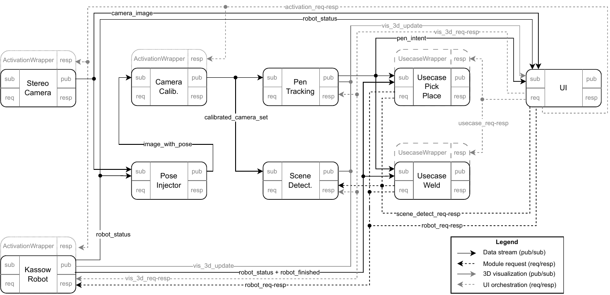

7) Placeholder for missing image/video:

PLACEHOLDER: image or video goes here

Image convention used here:
- vector/diagram assets are referenced as assets/*.svg
- screenshots/photos/renders are referenced as assets/*.png
- the provided package also includes PNG fallbacks; replace SVG wrappers with your real vector exports if available
-->

<!-- _class: lead -->

# Defining Robot Trajectories Using Augmented Reality

**Jakub Medek**  
Supervisor: RNDr. David Obdržálek, Ph.D.

Master's thesis, 2026

---

## Motivation

- Collaborative robots can work closer to humans
- Programming still often exposes low-level steps
- Can we define the task **more intuitively**?

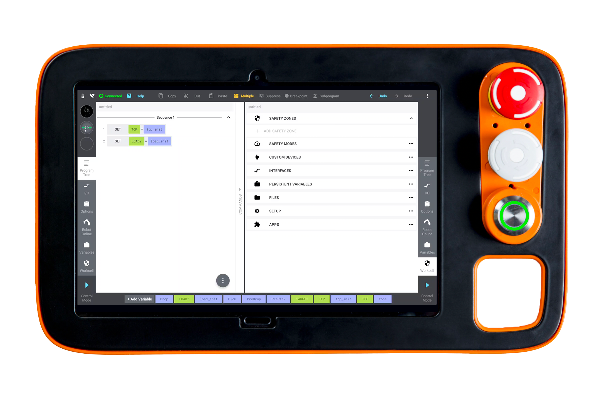

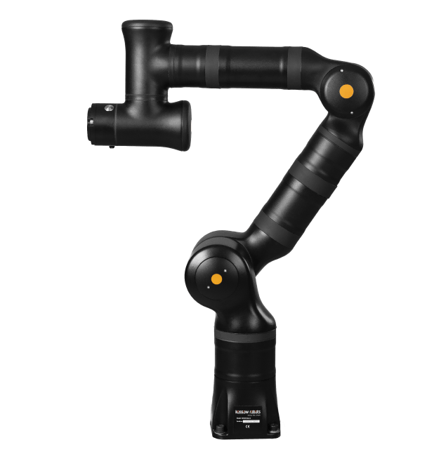

<!--
Narozdíl od klasických průmyslových robotických manipulátorů jsou kolaborativní manipulátory schopné pracovat v prostředích, kde se lidé pohybují v okolí robota. To mimo jiné umožňuje značně jednodušší použití robotů v úlohách, které se často mění nebo kde je člověk součástí procesu.

Samotné programování ale pořád může být poměrně nízko-úrovňové - typicky se jedná o definici programu pomocí bodů a trajektorií v prostoru, ovládání externích nástrojů a nastavení parametrů. I za předpokladu znalosti programovacího jazyka robota je tato úloha časově náročná. 

Tím se dostáváme k hlavní otázce práce - úloha programování robota je silně prostorová, nemůže tedy uživatel zadat konkrétní část dané úlohy přímo v prostoru místo toho aby vytvářel program krok za krokem?
-->

---

## From Spatial Intent to Robot Task

- The user does not define the whole program. 
- The user defines <strong>spatial intent</strong> and requried <strong>task specific parameters</strong>.

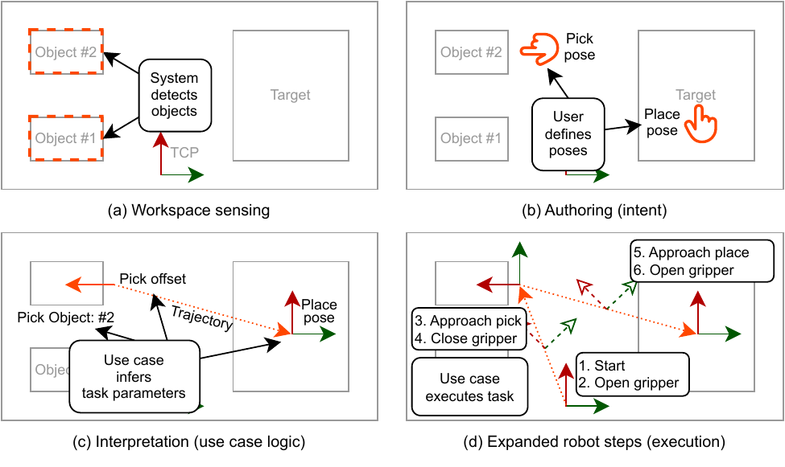

<!--
V rámci práce nejde pouze o slepé přehrání nahrané trajektorie, nýbrž o zadání záměru - např. uživatel zadá svár pro svaření nebo vybraný objekt a systém určí trajektorii / program robota.

Systém tento vstup zkombinuje s daty o scéně a s logikou konkrétní úlohy, neboli use casu. Use case rozhoduje, co vstup znamená, a rozšíří ho na robotické příkazy.

[extra]
Například čára nakreslená perem ve svařovacím use casu se změní na approach, začátek svařování, pohyb při svařování, konec svařování a depart. U pick-and-place může být póza interpretována relativně k detekovanému objektu.
-->

---

## Target Tasks

### Pick-and-place

**Define**:
  - pick pose (above object)
  - place pose

**Infer**:
  - pick object type
  - pick offset
  - place pose

**Runtime (dynamic)**: 
  - *detect* objects 
  - *move* to defined object and *pick*
  - *move* to place pose and *place*

### Seam welding

**Define**:
  - rough seam trajectory

**Infer**:
  - object positions
  - possible seam placements
  - intended seam placement

**Runtime (predefined/fixed)**:
  - *move* to approach
  - *move* to start, *start welding*
  - *move* to end, *stop welding*
  - *move* to depart

<!--

Tato práce se soustředí na předem připravené, úlohově orientované "use-casy". Každý use case určuje, jaké vstupy potřebuje a jak se tyto vstupy interpretují. Uživatel pak zvolí existující use-case a zadá prostorový vstup a případně další parametry.

Použil jsem dvě reprezentativní skupiny úloh. Pick-and-place reprezentuje manipulační úlohu, kde se pozice objektů ve scéně typicky mění mezi vytvořením a během programu. Svařování naopak reprezentuje statickou úlohu, zaměřenou na přesnou trajektorii robota. Svařování je zároveň typická úloha pro často se měnící zadání, např. v malovýrobě. 

-->

---

## Design Goals

- robot programming using spatial input
- extensible system where new use-cases can re-use existing infrastructure
- demonstrate approach on two representative usecases (Pick-and-place, Seam Welding)

<!--

Vytvořený systém by měl podporovat
- Využití primárně prostorového vstupu pro definici parametrů.
- Jednoduché rozšíření o další use-case moduly.
- Ukázat řešení na dvou reprezentativních use-case modulech.

-->

---

## What the System Needs

- **6DoF input** for poses and trajectories
- **Scene detection** for objects and their poses
- **UI** for parameters, confirmation, and visualization
- **Robot interface** for execution
- **Use case plugins** for task-specific logic

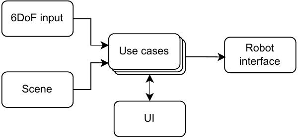

<!--
Z těchto dvou úloh přirozeně vychází požadavky na systém. Uživatel potřebuje prostorové vstupní zařízení. Systém potřebuje informace o scéně, protože samotný prostorový vstup nestačí pro pochopení záměru uživatele. UI řeší volbu usecase, extra parametry a potvrzení. Robotické rozhraní spouští výsledný program. A nakonec je nutná podpora pro samotné usecase moduly.

Detailněji si probereme prostorový vstup, detekci scény a volbu kamery.
-->

---

## Spatial Input

### Considered options

- hand tracking
- VR / AR controllers
- fiducial marker tracking

### Selected input

**custom tracked 6DoF pen**

- camera-tracked
- physical buttons for intent
- usable directly in the workspace

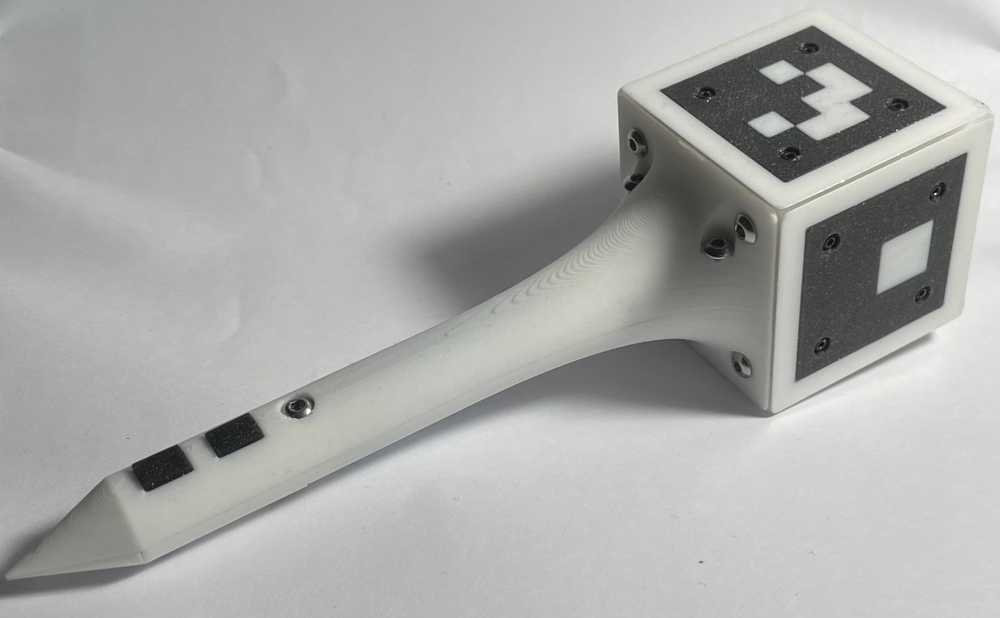

Tracked pen prototype with marker cube and buttons.

<!--
Vstup musí poskytovat 6DoF pozice a trajektorie v prostoru. Zároveň musí definovat způsob, jak může uživatel říct, že chce zaznamenat pozici nebo začít a ukončit trajektorii. (UMYSL UZIVATELE)

Zvažoval jsem sledování ruky, VR ovladače a marker tracking.

Pro implementovaný prototyp jsem nakonec zvolil vlastní sledované pero. Pero má ARuCO markery a fyzická tlačítka - tedy sledování je s pomocí existujících knihoven poměrně jednoduché a tlačítka umožňují jasně definovaný vstup. Komunikuje s počítačem přes BLE pomocí integrovaného mikrokontroleru a baterie. 
-->

---

<!-- _class: scene-slide -->

## Scene Sensing, Camera Setup

### Scene sensing
- Considered:
  - Model-based pose estimation
  - Scanning & reconstruction
  - Commercial systems
- Chosen: *fiducial tagged boxes*

### Camera setup
- Single/multi; robot-mounted/fixed...
- *Single stereo robot-mounted camera*

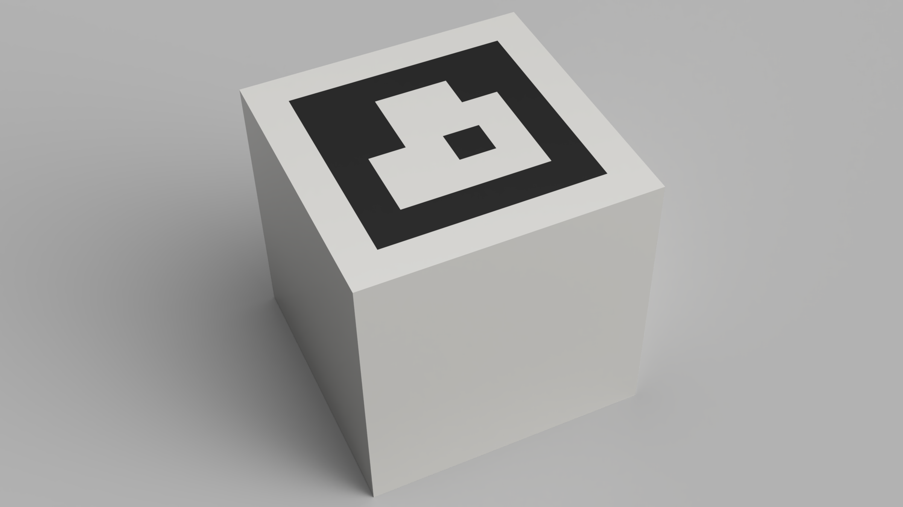

tagged box scene representation

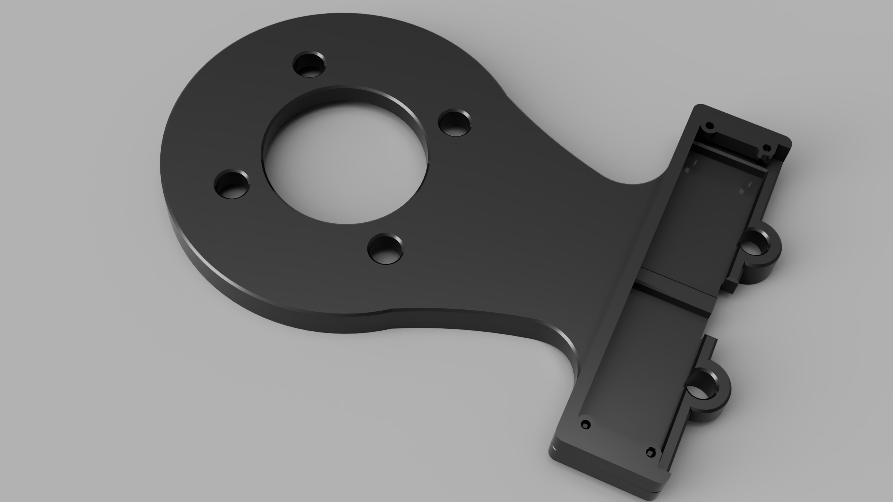

robot-mounted stereo camera mount

<!--
Pro zjednodušení detekce scény jsem použil reprezentaci pomocí objektů s ARuCo markery.
OR
Detekce scény je sama o sobě komplikovaný problém, proto jsem záměrně použil omezenou reprezentaci: objekty s ARuCo markery. Tím se práce soustředí na prostorové zadávání a modulární systém a ne na obecnou detekci objektů.

Pro detekci vstupu i scény využíváme kameru - pro kameru existuje několik možností: uvažoval jsem primárně mezi jednou či více kamerami, upevněnou na robotu nebo v prostoru a mono nebo stereo.

Pro práci jsem zvolil jednu stereo kameru připevňenou na robotu. To umožňuje lepší detekci hloubky než mono kamera, stabilnější hand-eye kalibraci vůči robotu než umístění v prostoru a značně jednoduší systém než podpora více kamer. 

Přesnost hloubky je totiž důležitá pro prostorový vstup i lokalizaci scény.
-->

---

## Modular Architecture

- the core contains no task-specific logic
- modules communicate through explicit interfaces

- input, scene, UI, robot, and use cases can be replaced
- the same infrastructure supports multiple tasks

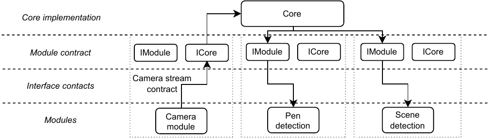

<!--

Jeden z požadavků byl podpora pro nové usecase moduly, což implikuje určitou abstrakci části systému.

Zároveň ale speciálně na začátku vývoje systému nebyl jasný směr (hand tracking nebo pero; jedna nebo více kamer).

Implementovaný systém tedy není jedna natvrdo napsaná demo aplikace, ale modulární runtime. Tato architektura tvoří podstatnou část práce.

Jádro pouze načítá moduly, propojuje je, přeposílá zprávy, spravuje lifecycle modulů a sdílenou infrastrukturu. Tedy, neví nic o svařování, pick-and-place ani o kamerách, UI apod. Sémantika komunikace je následně popsána v explicitních rozhraních vystavěných nad jádrem. Tím dochází ke kompletní abstrakci modulů - ty pak pouze definují požadované vstupy a výstupy a implementují chování.

Existující systém je tedy možné rozumně jednoduše rozšířit o hand-tracking, podporu více kamer, změnit vstup a visualizaci na VR apod. 
-->

---

## Instantiated Prototype System

<!--
Toto je úplný graf modulů použitý ve finálním prototypu. 

Na vstupu máme kameru a robota, ze kterých získáme pozici pera a příp. objektů ve scéně. Data z kamery prochází kalibračním modulem, který přidá intrinsic parametry kamer a pozice kamer na základě pozice ramene, hand-eye kalibrace a stereo kalibrace. Use-case moduly pak používají výstup pen tracking a scene detection modulů a ovládají robota. 
UI orchestruje setup grafu, vizualizaci scény, parametry, potvrzení a spuštění use-casů a persistenci.
-->

---

## Graph creation: add module

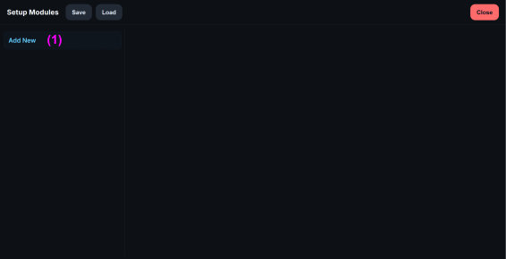

<!-- 
Tento graf vytváří uživatel při prvním spuštění systému - jedná se znovu o zvýšení flexibility systému. UI modul nezávisí na konkrétní instanciaci systému, tedy umožňuje flexbilitu nejen pro budoucí use-case moduly.
-->

---

## Graph creation: pick module

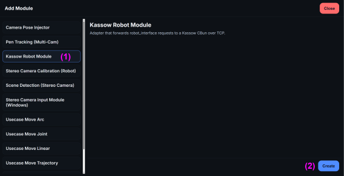

<!-- 
Uživatel postupně přidá moduly, které potřebuje.
-->

---

## Graph creation: activate module

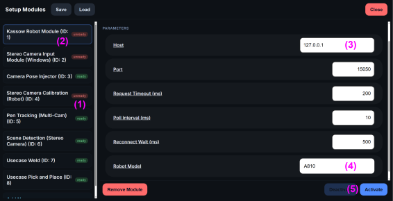

<!-- 
A následně aktivuje moduly, které vyžadují aktivaci. Primárně moduly, které komunikují s hardware (tedy robot a kamera) a kalibrační modul, kde se aktivace používá jako kalibrace.
-->

---
## Video Preview

<a href="https://www.youtube.com/watch?v=-o-_Q32bI_4" target="_blank">
    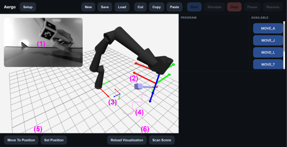
</a>

<!--

- app běží na pc, simulátor robota běží na pc, v produkci by byl připojený přes ethernet k pc, kamera je připojená k pc
- systém ovládám přes web app na tabletu který je dole vlevo (a vpravo vidět taky)
- koukat primárně dolů vlevo, nad tím je jen vidět že Kassow simulátor pohyb sedí s pohybem co ukazujeme
- příp. při definici trajektorie apod koukat klidně doprava, že pohyby sedí se zaáznamem.

"teď zadávám vpravo trajektorii"
-->

---

## Conclusion and Boundaries

### Result
An end-to-end prototype for **spatial authoring of prepared robot tasks**.

### Demonstrated

- custom tracked 6DoF pen
- stereo sensing and calibration
- modular runtime
- pick-and-place and seam welding
- execution on a collaborative robot

### Boundaries

- qualitative evaluation
- simplified tagged-object scene detection
- no collision planning
- tool actions approximated by fixed delays
- not a general robot-programming language

<!--
[Speaker notes | CZ]
Odpověď na výzkumnou otázku je v rámci připravených use casů pozitivní. Systém ukazuje, že prostorový vstup, snímání scény, úlohově specifická interpretace a robotické spuštění mohou být spojeny do jednoho end-to-end workflow.

Zároveň to není tvrzení o production-ready systému. Vyhodnocení je kvalitativní, vnímání scény je záměrně zjednodušené a širší nasazení by vyžadovalo lepší sensing, abstrakci nástrojových akcí, plánování pohybu, collision checking a systematičtější evaluaci.

Na závěr bych řekl, že hlavním přínosem je konkrétní implementovaný základ pro in-workspace spatial authoring kolaborativních robotických úloh.

[Original plan note | EN]
Use a clean “result collage”: robot arm + pen + full system small + video screenshot. The answer to the research question is positive within the prepared-use-case scope. At the same time, this is not a claim of production readiness.
-->

---

## Why not ROS?

### Reasons for a custom runtime

- **Explicit module graph control**
   - UI-driven graph construction
   - possible programmatic graph construction

- **Data ownership and performance**
   - large camera frames
   - shared payloads instead of repeated deep copies

- **Lower initial integration risk**
   - known C++ stack
   - thesis-specific interfaces

### Retrospective assessment

- **ROS would improve reusability**
   - more standard ecosystem
   - easier for others to understand

- **Some assumptions were conservative**
   - flexibility likely achievable in ROS
   - performance may also be solvable

- **Still justified for this thesis**
   - the custom runtime is part of the contribution
   - it made the contracts and workflow explicit

<!--
Krátká odpověď je, že ROS by určitě byla rozumná alternativa. Je to standardní ekosystém, ostatní robotici ho znají, existuje spousta hotových nástrojů a z hlediska budoucí rozšiřitelnosti by to pravděpodobně zjednodušilo převzetí projektu někým dalším.

V době návrhu jsem ale řešil hlavně to, že jsem chtěl mít velmi explicitní kontrolu nad tím, jak se systém skládá z modulů. V mém systému není graf modulů jen pevná konfigurace napsaná předem. Může ho vytvářet uživatel přes UI, a stejný mechanismus by šel použít i pro to, aby graf vytvořil jiný řídicí modul při startu systému. Chtěl jsem tedy mít pod kontrolou lifecycle modulů, jejich rozhraní, směrování zpráv a mapování kanálů.

Druhý důvod byla práce s velkými daty, hlavně s kamerovými snímky. Chtěl jsem se vyhnout tomu, aby se obrazová data zbytečně hluboce kopírovala mezi částmi systému. Proto jsem navrhl sdílené payloady s shallow copy / reference counting pro velká data. ROS podobné problémy samozřejmě umí nějak řešit také, ale pro rozsah práce mi vlastní runtime dával jasnou kontrolu nad tím, co se přesně děje.

Třetí důvod byl praktický. Rozhodnutí padalo poměrně brzy v životě práce, kdy ještě nebyly úplně zřejmé všechny důsledky návrhu. Měl jsem jistější C++ stack a vlastní runtime se tehdy zdál jako menší integrační riziko než stavět celý systém na ROSu, který jsem neznal dostatečně do hloubky.

Zpětně bych ROS zvažoval vážněji, hlavně kvůli standardizaci, nástrojům a tomu, že by projekt byl srozumitelnější pro širší robotickou komunitu. Zároveň si ale myslím, že vlastní runtime je v kontextu této práce obhajitelný, protože není jen pomocná infrastruktura. Explicitní modulové kontrakty, mapování kanálů, vlastnictví dat a skládání aplikace z modulů jsou součástí výsledku práce.

-->

---

<!-- _class: backup -->

## Channel Mapping / Communication Model

- publish / subscribe for streams
- request / response for explicit queries
- directed channel mapping, not global broadcast
- UI can inspect and build the graph

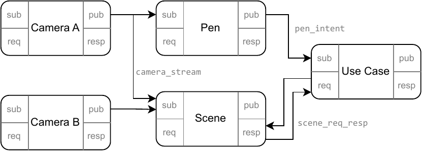

<!--
[Speaker notes | CZ]
Toto je backup pro dotazy na architekturu. Publish/subscribe se používá pro kontinuální data, například camera stream. Request/response se používá pro věci, které mají proběhnout na vyžádání, například detekce scény. Důležité je, že spojení mezi moduly jsou explicitně mapovaná.

[Original plan note | EN]
Talk about publish/subscribe for streams and request/response for explicit actions only if asked about architecture.
-->

---

<!-- _class: backup -->

## Calibration

- camera intrinsics
- stereo extrinsics
- hand-eye calibration
- Charuco target
- recalibrate if the mount changes

<!--
[Speaker notes | CZ]
Kalibrace propojuje obrazová data s robotickými souřadnicemi. Zahrnuje intrinsics kamer, stereo vztah mezi kamerami a vztah mezi kamerou a robotickou přírubou. Pokud se mechanický mount změní, je potřeba kalibraci zopakovat.

[Original plan note | EN]
Use camera_mount_bg.png and maybe calibration board screenshot/PDF. Key points: intrinsics, stereo extrinsics, hand-eye calibration, Charuco target, re-calibrate if mount changes.
-->

---

<!-- _class: backup -->

## Pen Tracking Details

- ArUco marker detection
- multi-camera pose candidates
- reprojection scoring
- Ceres refinement
- smoothing
- button-derived intent events

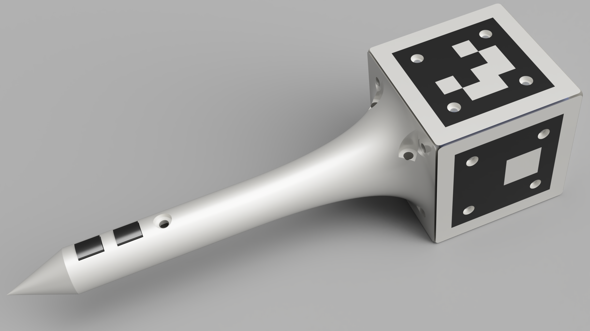

<!--
[Speaker notes | CZ]
Toto je technický backup ke sledování pera. Pero má několik markerů, takže lze získávat kandidátní pózy z obrazu, vyhodnocovat je podle reprojekční chyby, zpřesňovat optimalizací a potom výstup lehce filtrovat. Fyzická tlačítka dávají explicitní intent events.

[Original plan note | EN]
Key points: ArUco detection, multi-camera pose candidates, reprojection scoring, Ceres refinement, one-euro smoothing, button-derived intents.
-->

---

<!-- _class: backup -->

## What Is Not Implemented

- no general robot-programming language
- no automatic arbitrary intent recognition
- no full object detection
- no collision checking
- no real welding / gripper tool abstraction
- no formal user study

<!--
[Speaker notes | CZ]
Tento slide je užitečný pro vymezení hranic. Systém není obecný programovací jazyk pro roboty a nesnaží se automaticky hádat libovolný záměr uživatele. Je to prototyp pro připravené use casy s explicitní úlohovou logikou.

[Original plan note | EN]
This backup is useful because it shows you know the boundary clearly.
-->
